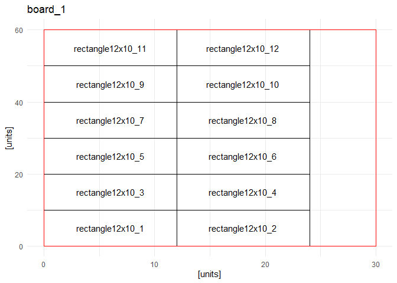

<!-- README.md is generated from README.Rmd. Please edit that file -->
<!-- In that case, don't forget to commit and push the resulting figure files, so they display on GitHub and CRAN. -->

# PTR

<!-- badges: start -->
<!-- badges: end -->

This package includes all functions required for a simplistic
determination of the required board-space for a given number of pots.
This is by no means exhaustive, and by no means the best algorithm for
this kind of packing-problem.

## Installation

You can install the development and release versions of PTR like so:

``` r
# release
devtools::install_github("https://github.com/Gewerd-Strauss/PTR@master")
# development
devtools::install_github("https://github.com/Gewerd-Strauss/PTR@dev")
```

If help-vignettes are to be downloaded, use instead:

``` r
devtools::install_github("https://github.com/Gewerd-Strauss/PTR@master",build_vignettes = T)
devtools::install_github("https://github.com/Gewerd-Strauss/PTR@dev",build_vignettes = T)
```

Vignettes are rendered documents discussing specific topics within a
package. Installing them is recommended, but not required for utilising
the package itself.

# Documentation

A Tray-Layout can be defined given the required number of pots, their
dimensions, as well as the dimensions of a board.

## Structure of a shelf

The functions in this package *technically* work on an abstract board of
any dimension. However, it is designed for the assumption that a `board`
constitutes the area marked in green (denoted by `(3)`). Obviously, you
can just decide that a `(2)` is a board, or even `(1)`. Up to you.


## Defining boards for circular & square pots

``` r
library(PTR)
## Circular pots
circle_pots <- PTR::PTR_generateBoardLayouts2(
  pots = 64,
  board_width = 30,
  board_height = 60,
  pot_radius = 5,
  distance = 0,
  lbls = paste0("circle_", 1:64),
  pot_type = "circle"
);
## Square pots
square_pots <- PTR::PTR_generateBoardLayouts2(
  pots = 64,
  board_width = 30,
  board_height = 60,
  pot_radius = 5,
  pot_diameter = 5,
  distance = 0,
  lbls = paste0("square_", 1:64),
  pot_type = "square"
)
```

The results of `PTR_generateBoardLayouts2()` has the principal structure

``` r
ret
  $board_{n}
           $points      ## a list denoting the x/y-coordinates of the center point of a pot-graphic
           $board_plot  ## the plot which is the main result of the function
           $input       ## a list denoting the input data
           $version     ## an internal versioning number to be used in various function processing
```

## Defining boards for rectangular pots

Rectangular pots are defined similarly. However, they require additional
arguments:

``` r
## Rectangular Pots
rectangle_pots <- PTR::PTR_generateBoardLayouts2(
  pots = 17,
  board_width = 30,
  board_height = 60,
  pot_radius = NA,
  pot_diameter = NA,
  pot_rectangle_width = 10,
  pot_rectangle_height = 12,
  distance = 0,
  lbls = paste0("rectangle10x12_", 1:17),
  pot_type = "rectangle"
)
## Flipping the pot-dimensions 
rectangle_pots_flipped <- PTR::PTR_generateBoardLayouts2(
  pots = 17,
  board_width = 30,
  board_height = 60,
  pot_radius = NA,
  pot_diameter = NA,
  pot_rectangle_width = 12,
  pot_rectangle_height = 10,
  distance = 0,
  lbls = paste0("rectangle12x10_", 1:17),
  pot_type = "rectangle"
)
rectangle_pots_not_flipped <- PTR::PTR_generateBoardLayouts2(
  pots = 17,
  board_width = 30,
  board_height = 60,
  pot_radius = NA,
  pot_diameter = NA,
  pot_rectangle_width = 12,
  pot_rectangle_height = 10,
  distance = 0,
  lbls = paste0("rectangle12x10_", 1:17),
  pot_type = "rectangle",
  rectangle_enforce_given_orientation = TRUE
)
```

## Example Boards

The following figures showcase the first board for the example-codes
above:

<div class="figure">


<p class="caption">
Fig.1: The first board for the circle-example above. Note that the
x-&y-axis are not equally scaled.
</p>

</div>

<div class="figure">


<p class="caption">
Fig.2: The first board for the square-example above. Note that the
x-&y-axis are not equally scaled.
</p>

</div>

<div class="figure">


<p class="caption">
Fig.3: The first board for the rectangle-example above.
</p>

</div>

<div class="figure">


<p class="caption">
Fig.4: The first board for the second rectangle-example above, where the
pot-dimensions are flipped relative to the first one.
</p>

</div>

<div class="figure">


<p class="caption">
Fig.5: The first board for the second rectangle-example above, while
enforcing the dimensions of ‘board_width’ & ‘pot_width’ to be locked to
each other via setting ‘rectangle_enforce_given_orientation=TRUE’. This
option is intended to be used when rectangle-post *must* be placed in a
specific orientation, even if it doesn’t fit the most pots onto a board.
Notice that less pots could be fit onto the first board compared to the
previous figures.
</p>

</div>

## Rotating Boards

Boards can be rotated via the function `PTR::PTR_rotateBoards()`:

``` r
circle_pots_rotated <- PTR::PTR_rotateBoards(circle_pots,-1)
```

<div class="figure">


<p class="caption">
Fig.6: The first board now contains the pots of the previously-last
board of ‘circle_pots’.
</p>

</div>

<div class="figure">


<p class="caption">
Fig.7: The second board now contains the pots of the previously-first
board of ‘circle_pots’.
</p>

</div>

## Rotating Pots

Pots can be rotated within a board by using `PTR::PTR_rotatePots()`:

``` r
# positive integers shift a board to the next-up position
# negative integers shift a board th the previous position
circle_pots_pots_rotated <- PTR::PTR_rotatePots(circle_pots,shifts = 2) 
```

<div class="figure">


<p class="caption">
Fig.8: Pots are rotated left to right, bottom to top on a
per-board-basis
</p>

</div>

<div class="figure">


<p class="caption">
Fig.9: Incomplete Trays behave as complete trays when rotating pots.
</p>

</div>

Note that a circular shift is not possible on a general board for `N`
pots, and therefore currently an index-based shift is used.

## Sorting Pots by Replicate-Number

Using `PTR::PTR_sortPots_by_potindex()`, you can sort pots by replicate
number. This requires two things:

- manually labelled pots
- Labels complying to the principal format `{GroupName}_{ReplicateID}`

<div class="figure">


<p class="caption">
Fig.10: Pots with names assigned in sequential order
</p>

</div>

<div class="figure">


<p class="caption">
Fig.11: Pots ordered by replicate-index
</p>

</div>

Be aware that sorting pots via `PTR::PTR_sortPots_by_potindex()` will
*recreate* the boards from scratch. As a result, the following order of
operations

``` r
# this step is not required, but necessary for this example. We load example 9, 
# which creates 2 boards. The latter one is not fully populated.
labelled_boards <- PTR::PTR_load_dummy_data(9)

# swap around the 2 boards. The 'incomplete' board is now in 'board_1'.
replicates_shift_boards <- PTR::PTR_rotateBoards(labelled_boards) 

# sort around the labels so that groups are uniformly distributed.
# this means that 'replicates_boards_shifted_sort_pots$board_1'
# is populated completely yet again, even though
# 'replicates_shift_boards$board_1' is not filled completely.
replicates_boards_shifted_sort_pots <- PTR::PTR_sortPots_by_potindex(replicates_shift_boards)
#> Warning: Note: This function will also sort elements which share the same pot-index (e.g. 'UU_1/UG_1/ABAU_1/ABAG_1/UU_2/UG_2/...' alphabetically within each set of indices.
#> For the example above, this will return 'ABAG_1/ABAU_1/UG_1/UU_1/UG_2/UU_2/...'.
```

will refill `replicates_boards_shifted_sort_pots$board_1` (B), compared
to `replicates_shift_boards$board_2` (A):

<div class="figure">


<p class="caption">
Fig 12: (A) Board_1 after rotating boards, but before rearranging
labels. (B) Board_1 after both rotating boards and rearranging labels.
For overview-purposes only; this plot does not resemble typical output.
</p>

</div>

Thus, it is recommended to call `PTR::PTR_sortPots_by_potindex()`
*first*, then rotate boards and/or pots. Due to the way the
sorting-function works, this minor limitation is unlikely to be
resolved.

``` r
# this step is not required, but necessary for this example. 
N <- 8
N2 <- 2
labels <- c("UU", "UG", "ABAU", "ABAG")
repeated_vector <- rep(labels, each = N)
labels_calibration <- c("cUU","cUG","cABAU","cABAG")
repeated_vector2 <- rep(labels_calibration,each = N2)
# Create the indices vector
indices <- rep(1:N, times = length(labels))
indices2 <- rep(1:N2, times = length(labels_calibration))
# Combine repeated_vector and indices using paste
labels1 <- paste(repeated_vector, indices, sep = "_")
labels2 <- paste(repeated_vector2, indices2, sep = "_")
labels_ <- c(labels1,labels2)
print(labels_) # let's display the labels we want to assign
#>  [1] "UU_1"    "UU_2"    "UU_3"    "UU_4"    "UU_5"    "UU_6"    "UU_7"   
#>  [8] "UU_8"    "UG_1"    "UG_2"    "UG_3"    "UG_4"    "UG_5"    "UG_6"   
#> [15] "UG_7"    "UG_8"    "ABAU_1"  "ABAU_2"  "ABAU_3"  "ABAU_4"  "ABAU_5" 
#> [22] "ABAU_6"  "ABAU_7"  "ABAU_8"  "ABAG_1"  "ABAG_2"  "ABAG_3"  "ABAG_4" 
#> [29] "ABAG_5"  "ABAG_6"  "ABAG_7"  "ABAG_8"  "cUU_1"   "cUU_2"   "cUG_1"  
#> [36] "cUG_2"   "cABAU_1" "cABAU_2" "cABAG_1" "cABAG_2"
labelled_boards_with_unequal_groups <- PTR_generateBoardLayouts2(
  pots = 40, ## note that we increased the number of pots. In this example, 
  board_width = 30,
  board_height = 60,
  pot_radius = 5,
  pot_diameter = 5 * 2,
  pot_rectangle_width = 5 * 2,
  pot_rectangle_height = 5 * 2,
  distance = 0,
  lbls = labels_,
  pot_type = "square"
)
```

    #> Warning: Note: This function will also sort elements which share the same pot-index (e.g. 'UU_1/UG_1/ABAU_1/ABAG_1/UU_2/UG_2/...' alphabetically within each set of indices.
    #> For the example above, this will return 'ABAG_1/ABAU_1/UG_1/UU_1/UG_2/UU_2/...'.

<div class="figure">


<p class="caption">
Fig 13: For overview-purposes only; this plot does not resemble typical
output.
</p>

</div>
